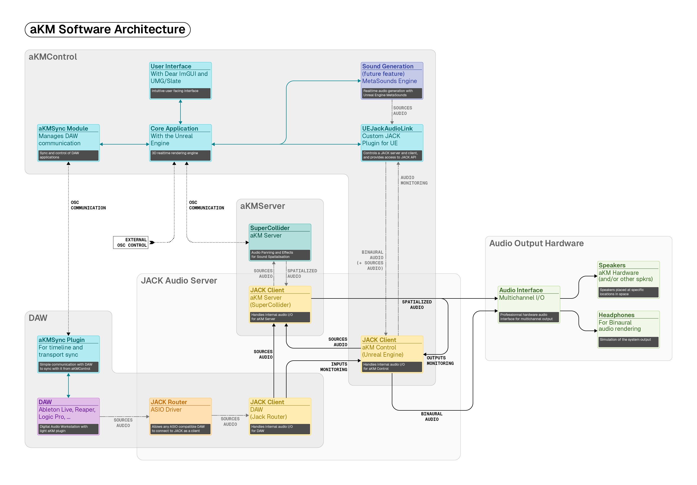

# aKMControl

Controller & Visualizer for the aKM spatial audio system (Unreal Engine 5.6)

[](https://www.gnu.org/licenses/gpl-3.0.en.html)

Pre-release prototype.


---

## Table of Contents

- [Overview / Presentation](#overview)
- [Installation](#installation)
- [Dependencies](#dependencies)
- [Screenshots](#screenshots)
- [Prerequisites](#prerequisites)
- [Using the pre-built executable](#using-the-pre-built-executable)
- [Clone & Build](#clone--build)
- [How it Works](#how-it-works)
- [Credits and Support](#credits-and-support)
- [License](#license)
- [Notes](#notes)

## Overview

aKMControl is the Unreal Engine front‑end for the aKM spatial audio system. It orchestrates boot, runtime control, and shutdown of the SuperCollider‑based aKMServer, provides a real‑time UI (ImGui‑based) to manipulate spatialization parameters, and manages JACK audio routing via the built‑in UEJackAudioLink plugin. Primary communication with the server is via OSC.

aKMControl is built with the **Unreal Engine 5.6**

> [!CAUTION]
> Currently, **the only supported platform is Windows (x64).** macOS and Linux support will follow soon.

Current defaults in this prototype:

- A few sources animations demonstrations hard coded into the app (one using a simple orbit, the other using a Niagara system to drive source positions)
- OSC: matches the aKMServer defaults (server listens on `127.0.0.1:23446`; ACK/heartbeat to `127.0.0.1:23444`)

## Installation

### Platform Support

- **Windows only** (for now)

### Dependencies

The UE Project has the following plugin dependencies:

- [Unreal ImGUI Plugin by IDI-Systems](https://github.com/IDI-Systems/UnrealImGui)
- OSC (Official UE Plugin)

Additionally, the project includes a custom plugin also developed by laplanque for the needs of this project, that brings a JACK integration to Unreal Engine 5.6:

- [**UEJackAudioLink**](https://github.com/contactlaplanque/UEJackAudioLink) (bundled in `Plugins/UEJackAudioLink`)

> [!CAUTION]
> This plugin is still in experimental state, and even if so far it has been working great, only a limited range of setups have been tested.

## Prerequisites

- [SuperCollider](https://supercollider.github.io/) 3.12+ with SC3-plugins
- [aKMServer](https://github.com/contactlaplanque/akm-server) SuperCollider script available locally
  - Recommended: clone the aKMServer repository into your Documents folder, and remove the “-main” suffix if present:
    - Path: `C:\Users\<You>\Documents\akm-server` containing `akM_spatServer.scd`
  - Or specify the absolute path to `akM_spatServer.scd` in the Unreal Editor project settings (see Notes)
- Unreal Engine 5.6 installed
- JACK Audio Connection Kit for Windows: [https://jackaudio.org/downloads/](https://jackaudio.org/downloads/)

- If you plan to build locally the project, make sure to have an operational Unreal Engine development setup with the right set of Visual Studio Build Tools, Windows SDK, .NET SDK, recommended by Epic. Many tutorials exist out there to setup such an environment.

## Screenshots


## Using the pre-built executable

### Setup

1) Go to the release page: [aKMControl-v0.1.0](https://github.com/contactlaplanque/akm-control/releases/tag/v0.1.0)
2) Make sure that the pre-requisites are installed on your machine (JACK for Windows, SuperCollider, aKMServer). These are linked on the release page.
3) Download the .zip archive on the release
4) Unzip the file
5) Start aKMControl by double-clicking on `aKMControl.exe`

### Usage 

[Video: Introduction](https://youtu.be/GbSd6QqimfQ)

[Video: Demonstration](https://youtu.be/T23ct6W0kBA)

## Clone & Build

### 1 - Clone with submodules (to ensure all bundled plugins are fetched):

```bash
git clone --recurse-submodules https://github.com/contactlaplanque/akm-control.git
```

> [!TIP]
> Do not forget the `--recurse-submodules` argument, or else the UEJackAudioLink plugin files will not be downloaded and the project will not build

### 2 - Generate Visual Studio solution:

- Right‑click `UE/aKMcontrol/aKMcontrol.uproject`
- Select “Generate Visual Studio project files”

### 3 - Open solution and build:

- Open the generated `.sln` in Visual Studio (or open the .uproject in JetBrains Rider)
- Select “Development Editor” configuration, Win64 platform
- Build the solution

### 4 - Run the project:

- Double‑click `UE/aKMcontrol/aKMcontrol.uproject` to open in Unreal Editor
- Or launch the built Editor target from Visual Studio

## How it Works



> [!NOTE]
> Not all features present on the architecutre diagram a yet implemented

- aKMControl launches SuperCollider’s `sclang.exe` to run `akM_spatServer.scd` and monitors its output to detect readiness and health.
- Runtime control uses OSC from the UE side to the server. 
- Audio routing is handled over JACK. The included UEJackAudioLink plugin exposes a UE client to the JACK graph and can connect `scsynth` outputs to Unreal inputs.

## Credits and Support

aKM is a project developped within _laplanque_, a non-profit for artistic
creation and the sharing of expertise, bringing together multifaceted artists working in both analog and digital media.

More details: [WEBSITE](https://laplanque.eu/) / [DISCORD](https://discord.gg/c7PK5h3PKE) / [INSTAGRAM](https://www.instagram.com/contact.laplanque/)

- The aKM Project is developped by: Vincent Bergeron, Samy Bérard, Nicolas Désilles
- Software design and development: [Nicolas Désilles](https://github.com/nicolasdesilles). 

- Supporters: La Région AURA, GRAME CNCM, la Métropole de Lyon, Hangar Computer Club, and private contributors


## License

GNU GPL‑3.0. See `LICENSE`.

## Notes

- This is a pre‑release prototype. Users are expected to explore the built executable, or the in‑editor project, while proper documentation is still being written.
- Only a very limited range of local machines has been tested. Early testers may need to use their skills to get the project building and running depending on local configurations (audio drivers, JACK install, device channel counts, UE SDK/toolchain, etc.).
- For Windows, the app looks for SuperCollider at `C:/Program Files/SuperCollider-3.13.0/` and the server script at `C:/Users/<You>/Documents/akm-server/akM_spatServer.scd` by default. If your setup differs, specify the path in the Project Settings (if available in your build) or adjust the path in `AakMSpatServerManager`.
